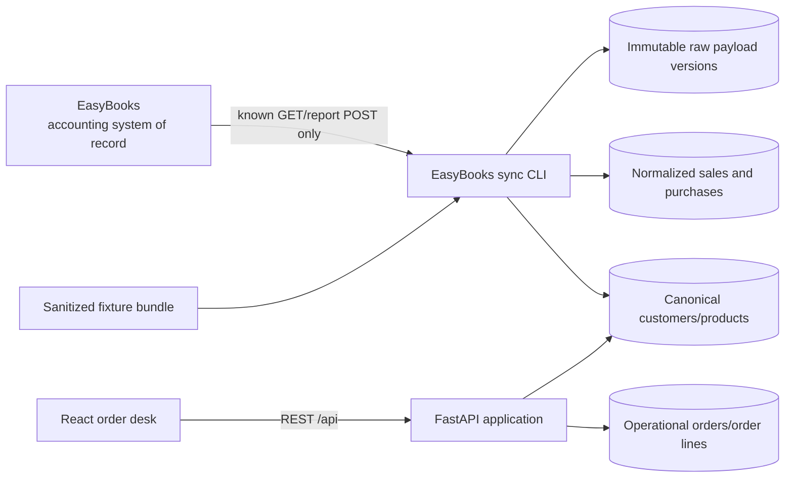

# UniOps v0.1

UniOps is the lightweight operational system of record for UniGreen's make-to-order paper converting workflow. It captures customer orders before accounting, shows their movement through production and delivery, and preserves read-only EasyBooks source data for audit and normalization.

EasyBooks remains the accounting system of record. UniOps v0.1 never creates, changes, or deletes EasyBooks data.

## Scope

Included in v0.1:

- canonical customers and products linked by stable EasyBooks codes or IDs;
- operational orders and order lines with a small forward-only lifecycle;
- New Order intake and an internal Order Board;
- read-only, live-opt-in EasyBooks transport;
- sanitized fixture ingestion for sales headers, sales lines, and purchase report rows;
- immutable raw payload versions, normalized accounting tables, sync metrics, and reconciliation warnings;
- SQLite migration, backend/API tests, and frontend tests/lint/typecheck/build.

Not included: production scheduling optimization, warehouse management, truck routing, EasyBooks write-back, AI decision-making, complex permissions, receivables workflows, or a generic ERP.

## Architecture



The repository is a small monorepo:

- `backend/app/api`: thin HTTP routes;
- `backend/app/services`: order and catalog business rules;
- `backend/app/integrations/easybooks`: constrained transport, normalization, reconciliation, and idempotent sync;
- `backend/migrations`: Alembic schema history;
- `backend/tests`: sanitized fixtures and backend/integration/API tests;
- `frontend/src`: React/TypeScript intake and board UI;
- `docs/easybooks-integration.md`: source-specific contract and live setup boundary.

SQLite is the selected v0.1 database so a small team can run the system without infrastructure. SQLAlchemy keeps persistence isolated, but another database is not a tested v0.1 promise. API handlers are async entry points around short synchronous database operations; this is intentionally simple for current load and should be revisited before high concurrency.

## Local development

Requirements:

- Python 3.12+
- [uv](https://docs.astral.sh/uv/)
- Node.js 22+ and npm

Install and migrate from the repository root:

```bash
uv sync --all-groups
uv run alembic upgrade head
cd frontend && npm install
```

`uv sync` installs `backend/app` as the editable `uniops` package, so `app.*` imports and the
`uniops` console script work from the repository root without extra `PYTHONPATH` handling.

Start the API:

```bash
uv run uvicorn app.main:app --reload
```

Start the frontend in another terminal:

```bash
cd frontend
npm run dev
```

Open `http://localhost:5173`. The Vite development server proxies `/api` to `http://127.0.0.1:8000`. API documentation is available at `http://127.0.0.1:8000/docs`.

## Database and configuration

Copy `.env.example` to `.env` and change only values needed locally. `.env` is ignored by Git.

The default database is `sqlite:///./uniops.db`. Build it or bring it to the current schema with:

```bash
uv run alembic upgrade head
```

Validate a migration from a clean temporary database:

```bash
UNIOPS_DATABASE_URL=sqlite:////tmp/uniops-clean.db uv run alembic upgrade head
```

All timestamps are stored using timezone-capable columns and application timestamps are UTC. Dates represent business calendar dates. Money uses fixed-scale `NUMERIC(18,2)` and Python `Decimal`; quantities use `NUMERIC(18,4)`. The API rejects JSON floating-point values for financial and quantity inputs—send decimal strings.

## EasyBooks fixture sync

The checked-in fixture is synthetic and contains no real customer, bank, credential, or company data.

```bash
uv run alembic upgrade head
uv run uniops sync-easybooks \
  --fixture backend/tests/fixtures/easybooks_bundle.json
```

Running the same command again is safe. The second run reports unchanged documents and does not duplicate raw or normalized rows. A changed source payload creates a new raw version and updates the normalized record.

Live mode is disabled by default and has not been authenticated or exercised in this repository. See [EasyBooks integration](docs/easybooks-integration.md) before enabling it.

A live run reads the observed contracts end to end: the sales list, the sales count, one sales detail per document, then raw preservation, normalization, and reconciliation. Every EasyBooks path is a connector constant, and the sales list is fetched in a single request because EasyBooks returns the whole matching array and paginates it client-side.

```bash
uv run uniops sync-easybooks --live \
  --from-date 2026-08-01 --to-date 2026-08-31
```

`--headers-only` remains as a diagnostic that runs the list, count, and purchase reads without the sales-detail route:

```bash
uv run uniops sync-easybooks --live --headers-only \
  --from-date 2026-08-01 --to-date 2026-08-31
```

## Order API

Core endpoints:

- `GET/POST /api/customers`
- `GET/POST /api/products`
- `GET/POST /api/orders`
- `GET/PATCH /api/orders/{order_id}`
- `POST /api/orders/{order_id}/status`
- `POST /api/orders/{order_id}/lines`
- `PATCH/DELETE /api/orders/{order_id}/lines/{line_id}`
- `GET /api/sync-runs` (read-only EasyBooks ingestion history and metrics)

Orders begin as `DRAFT` (shown as Waiting). The lifecycle is:

`DRAFT → CONFIRMED → SCHEDULED → IN_PRODUCTION → READY → DELIVERY_PENDING → DELIVERED → INVOICED → CLOSED`

Cancellation is allowed through the ready/delivery-pending stages. The service layer validates transitions, required dates, catalog references, positive quantities, and fixed-point monetary input.

## Tests and quality gates

```bash
uv run pytest
uv run ruff check backend
cd frontend
npm test
npm run lint
npm run build
```

## Known limitations

- EasyBooks live authentication requires a legitimate operator-provided token or session cookie; no credentials are stored.
- The EasyBooks sales list, count, and detail contracts come from direct observation of the company account; the connector implements those exactly and adds no server-side pagination, because the observed UI pages the returned array client-side.
- The purchase and sales dynamic-report response envelopes have not been directly observed; row extraction stays tolerant for those two routes only.
- Live mode has not been exercised from this repository. Fixture mode is the executed path; a first controlled live run still needs operator-supplied credentials.
- There is no application authentication or role model in v0.1. Deploy only on a trusted internal network until that is added.
- SQLite and synchronous database operations target the present small-team load, not high concurrency.
- No production scheduling, inventory, delivery optimization, invoicing, receivable, or payment workflow is implemented yet.

## Recommended v0.2

Build a narrow production-demand milestone: approve/confirm order intake, introduce production batches and planned operating windows constrained to 07:00–18:00, show capacity conflicts, and capture actual production completion. Keep delivery planning and EasyBooks write-back out until that workflow is observed and validated.

